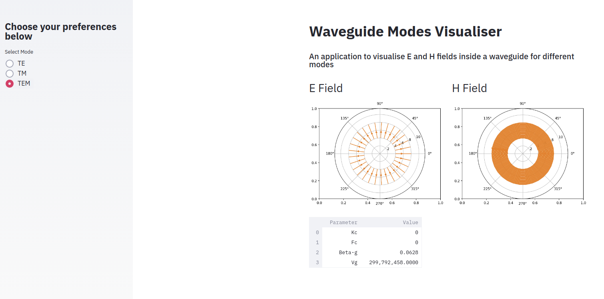

<div align="center">

# :india:  The Mode Visualiser :india: 


| **[ [```Website```](<http://wg-visualiser.herokuapp.com/>) ]** | **[ [```Documentation```](<docs/Project.pdf>) ]** | **[ [```Microwave101```](<https://www.microwaves101.com/encyclopedias/national-institute-of-technology-trichy>) ]** | **[ [```Microwaves @ Our Department```](<docs/Department.pdf>) ]** |
|:-------------------:|:-------------------:|:-------------------:|:-------------------:|

</div>

In this project, we have developed of a web application made to visualise field lines of Electric and Magnetic waves inside a waveguide. After an extensive analysis to locate related works on the internet, we propose a first of the kind Graphical User Interface for waveguide visualisation, as a public resource. Here we provide the user with options to visualise upto *N* modes, which does not exist in any current literature due to field complexity. Additionally, all the parameters related to the selected mode, including the cut off frequency, cut off wave number will be calculated and displayed. 


# Preview of our Visualisation




# Project Structure

```                   
├── README.md                   
├── images                        
│    ├── TE21.png
│    ├── TEM.png
│    └── full.png
├── docs                    
│    ├── Department.pdf
│    └── Project.pdf
├── Procfile   
├── requirements.txt   
├── setup.sh   
├── TE.py  
├── TEM.py   
├── TM.py   
├── app.py   
├── functions.py 
├── functions_circular.py
└── functions_rect.py                  

```   

*“The true laboratory is the mind, where behind illusions we uncover the laws of truth.”* ― **Jagadish Chandra Bose**
